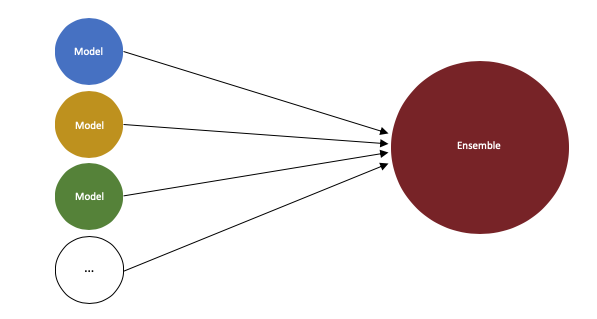

# ensemble

*A model ensemble package optimized for low barrier integration*



**ensemble** lets you combine your models and access them by a single object. You may use that ensemble to multiplex between your models, call them all, and aggregate the results. You may even create ensembles of ensembles!

This package borrows the idea of computation graph sessioning from [TensorFlow](https://github.com/tensorflow/tensorflow) and implements the [composite pattern](https://en.wikipedia.org/wiki/Composite_pattern) for building tree hierarchies.

### Documentation

[](https://ensemble-pkg.readthedocs.io/en/latest/?badge=latest)

Read the docs at [ensemble-pkg.readthedocs.io](https://ensemble-pkg.readthedocs.io)

### Installation

```
pip install ensemble-pkg
```

### Examples

Define your model functions and create your ensemble:

```python
>>> from ensemble import Ensemble
>>> def square(x):
...     return x**2
...
>>> def cube(y):
...     return y**3
...
>>> my_ensemble = Ensemble(
...     name='e1',
...     children=[function1, function2],
... )
```

Multiplex between functions:

```python
>>> my_ensemble(child='square', x=2)
4
>>> my_ensemble(child='cube', y=2)
8
```

Call all the models in the ensemble:

```python
>>> my_ensemble.all(x=2, y=2)
{'square': 4, 'cube': 8}
```

You may instead decorate your model functions with `@model` in order to attach them to an ensemble:

```python
>>> from ensemble import child
>>> @child('e2')
... def func1(x):
...     return x**2
...
>>> @child('e2')
... def func2(x):
...     return x**3
...
>>> e2 = Ensemble('e2')
>>> e2.all(x=3)
{'func1': 9, 'func2': 27}
```

You may even attach a model to multiple ensembles! (this is one main reason *ensemble* is useful)

```python
>>> @child('e2', 'e3')
... def func3(x, y):
...     return x**3 + y
...
>>> e2.all(x=2, y=3)
{'func1': 4, 'func2': 8, 'func3': 11}
>>>
>>> e3 = Ensemble('e3')
>>> e3.all(x=2, y=3)
{'func3': 11}
```

If you forget what models are in your ensemble, just check:

```python
>>> e2
Ensemble(
  name='e2',
  children={
    'func1': <function func1 at 0x1024fa9d8>
    'func2': <function func2 at 0x1024faa60>
    'func3': <function func3 at 0x1024fa950>
  },
  weights=None,
)
>>> e3
Ensemble(
  name='e3',
  children={
    'func3': <function func3 at 0x1024fa950>
  },
  weights=None,
)
```

In the above example, ensemble `e2` contains `func1`, `func2`, and `func3`, while ensemble `e3` contains just `func3`.
